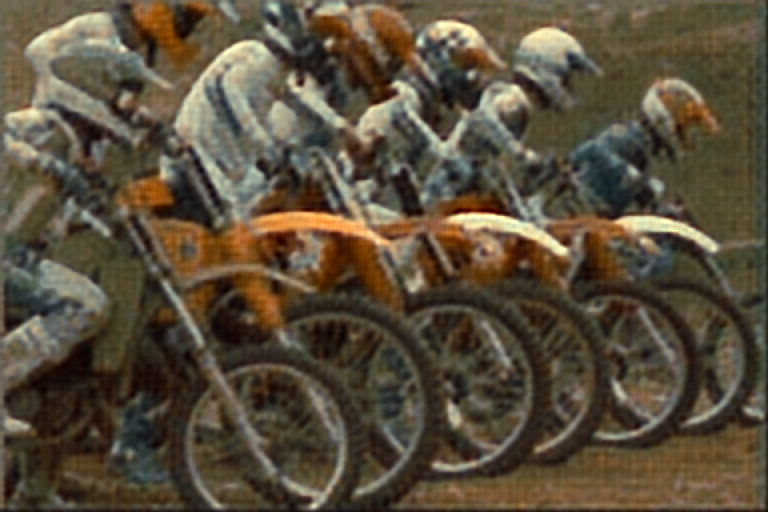

# No. DC-AI-C12: Image compression
This is one of the component benchmarks of AIBench, an Industry Standard AI Benchmark Suite for datacenter AI benchmarking.

This problem domain is to compress the images and reduce the redundancy.


This repo is a Tensorflow implementation of paper [Full Resolution Image Compression with Recurrent Neural Networks](https://arxiv.org/pdf/1608.05148.pdf). This repo also contains a trained Residual LSTM model (saved in `save/`) on a small dataset (doesn't include dataset). Here is one example shown in the paper

Original image:


Reconstruction:



### Requirements
- SciPy
- Tensorflow 1.4+

### Usage
Training, put training data in `imgs/` folder and run following code for default setting. The model parameter can be modified in `model.py`. Running time comparison of original and reconstructed images can be seen in `eval/`. Model file is saved in `save/model`.

```
python train.py
```

Encoding

```
python encode.py --model save/model --input kodim05.png --iters 10 --output compressed.npz
```

Decoding

```
python decode.py --model save/model --input compressed.npz --output compressed.png
```

Evaluation, code from Tensorflow's official [repo](https://github.com/tensorflow/models/blob/master/research/compression/image_encoder/msssim.py)

```
python msssim.py -o kodim05.png -c compressed.png
```
